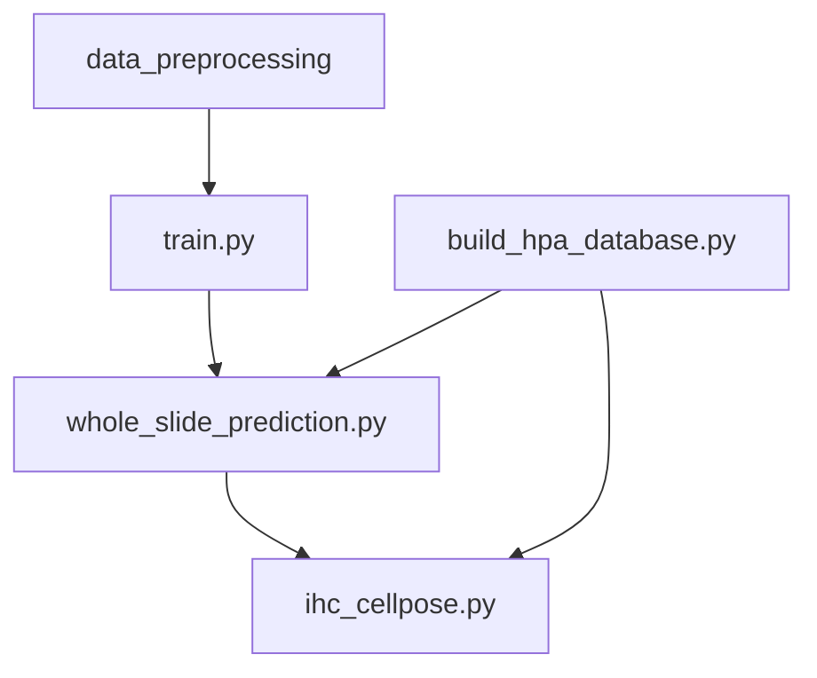

# Skin IHC / Epidermis Analysis Pipeline

> End-to-end pipeline for epidermis-focused analysis of skin immunohistochemistry (IHC) images, combining deep learning–based tissue segmentation, whole-slide inference, HPA data integration, and cell-level segmentation.

---

## Overview

This repository provides a complete workflow for:

* Semi-automated image cropping (H&E, mask, IHC)
* Deep learning tissue segmentation (epidermis, keratin, background)
* Scalable whole-slide / large-image inference with refinement
* Local Human Protein Atlas (HPA) database construction
* Cell-level segmentation within epidermal regions using Cellpose

The pipeline is designed for **reproducible, large-scale histopathology analysis**.

---

## End-to-End Workflow



---

## Pipeline Components (High-Level)

### 1. Image Cropping

**Scripts:** `crop_data.py`, `manual_cropping.py`, `automated_cropping.py`

* Semi-automated ROI extraction from H&E, mask, and IHC images
* Manual GUI + reproducible batch cropping

📄 *Details:* `docs/01_image_cropping.md`

---

### 2. HPA Database Construction

**Script:** `build_hpa_database.py`

* Builds a local SQLite database from HPA TSV + XML files
* Extracts skin-specific expression, IHC images, and metadata

📄 *Details:* `docs/02_hpa_database.md`

---

### 3. Tissue Segmentation Training

**Script:** `train.py`

* ResNet-based U-Net for epidermis/keratin segmentation
* Data augmentation, Dice + Focal loss, Optuna support

📄 *Details:* `docs/03_training.md`

---

### 4. Whole-Slide Inference

**Script:** `whole_slide_prediction.py`

* Coarse-to-fine inference on large IHC images
* Region refinement and biologically informed post-processing

📄 *Details:* `docs/04_whole_slide_inference.md`

---

### 5. Cell-Level Segmentation

**Script:** `ihc_cellpose.py`

* Cellpose-based segmentation within epidermal regions
* Color deconvolution + full-resolution cell masks

📄 *Details:* `docs/05_cell_segmentation.md`

---

## Requirements

### Core Environment

* **Python** ≥ 3.9
* **GPU strongly recommended** for model training and large-scale inference

### Deep Learning & Segmentation

* **TensorFlow** == 2.15
* **Keras** == 2.15
* **segmentation_models** (Qubvel, GitHub version)
* **efficientnet**, **image-classifiers**

### Cell Segmentation

* **Cellpose** ≥ 2.2 (`cellpose==2.2.3`)

### Scientific Computing & Image Processing

* **NumPy**, **SciPy**, **pandas**
* **scikit-image**, **scikit-learn**
* **OpenCV** (`opencv-python`)
* **Pillow**
* **tifffile**
* **shapely**

### Visualization & Logging

* **matplotlib**
* **seaborn**
* **plotly**
* **tqdm**
* **tensorboard**

### Optimization & Experiment Management

* **Optuna** (+ `optuna-integration`)
* **SQLAlchemy** (SQLite backend)
* **alembic** (optional schema management)

### Configuration & Utilities

* **PyYAML**
* **requests**
* **xml.etree.ElementTree** (Python standard library)
* **joblib**
* **psutil**

### Interactive / Development (Optional)

* **JupyterLab / Notebook**
* **ipykernel**, **ipywidgets**
* **graphviz** (model visualization)
* **pre-commit**

---

## Installation

```bash
pip install -r requirements.txt
```

---

## Quick Start (Minimal)

```bash
# 0. Build local Human Protein Atlas (HPA) database
# (Required for database-driven inference and Cellpose steps)
python -m scripts.database.build_hpa_database

# 1. Crop images (H&E / mask / IHC)
python -m scripts.crop_data

# 2. Train tissue segmentation model
python -m scripts.train --version v001

# 3. Whole-slide / large-image inference
# (Loads image URLs + metadata from the local HPA SQLite database)
python -m scripts.whole_slide_prediction \
    --model path/to/model.keras \
    --mode database \
    --version v001

# 4. Cell-level segmentation in epidermis (Cellpose)
python -m scripts.epidermis_analysis.ihc_cellpose \
    --version v001

```

---

## Documentation

Detailed documentation for each module is available in the `docs/` directory:

* `docs/01_image_cropping.md`
* `docs/02_hpa_database.md`
* `docs/03_training.md`
* `docs/04_whole_slide_inference.md`
* `docs/05_cell_segmentation.md`

---
## License

This project is licensed under the MIT License. See the [LICENSE](LICENSE) file for details.

---

## Citation

If you use this code in your research, please cite:

**Name**, Contributor Name, *Title of Paper*, Journal/Conference, Year. [DOI or preprint link if available]

---

## Acknowledgements

Thanks to **Contributor Name** for testing and feedback on the code.  

---

